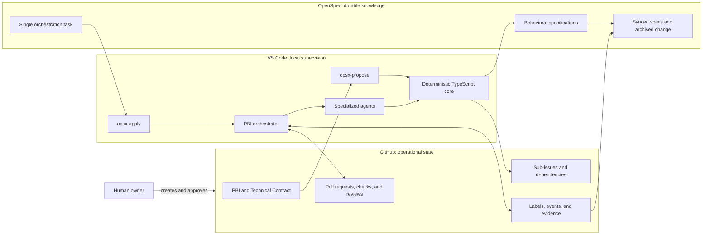
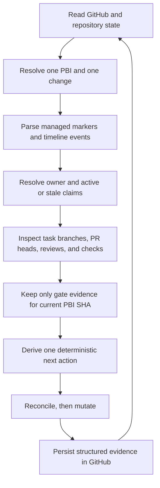
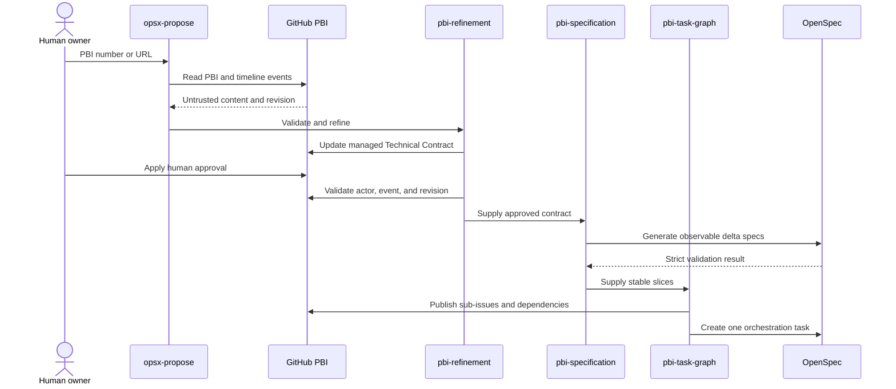
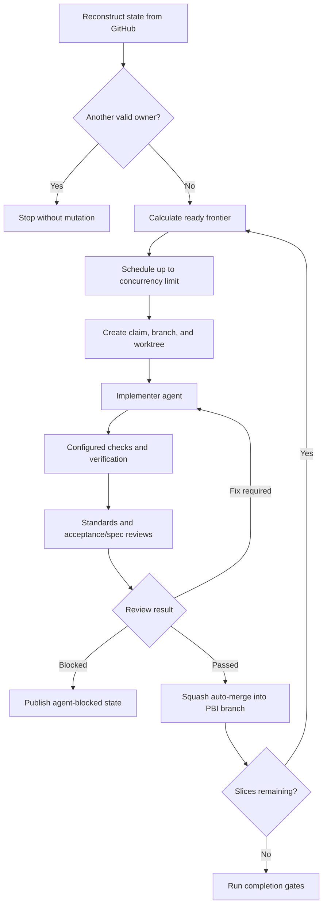
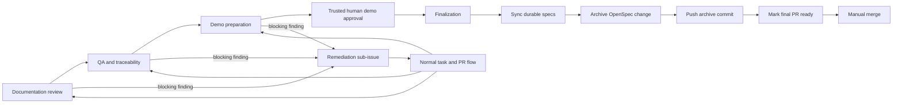

# POC: PBI-Driven Workflow with OpenSpec and GitHub Copilot

This repository is a **proof of concept (POC)** exploring how to turn a GitHub Product Backlog Item (PBI) into a specification-driven implementation coordinated by specialized agents and supervised locally from VS Code.

It is not intended to be production-ready. Its purpose is to validate an approach where:

- one PBI maps to exactly one OpenSpec change;
- GitHub owns operational and auditable workflow state;
- OpenSpec preserves durable behavioral specifications;
- GitHub Copilot coordinates refinement, implementation, review, and validation;
- sensitive operations rely on deterministic, tested TypeScript tooling;
- human approvals and automated evidence are bound to a specific revision or commit SHA.

## Run the Daily Journal

The PBI-1 product slice is a local Flask application backed by SQLite.

```bash
python -m venv .venv
source .venv/bin/activate
python -m pip install -r requirements.txt
python app.py
```

Open `http://127.0.0.1:5000/` to select a day and create a task, event, or note. The default database is created at `instance/journal.sqlite3`.

Run the application tests with:

```bash
python -m unittest -v test_journal.py
```

## POC Goals

The POC evaluates whether a product requirement can move from definition to a final pull request while preserving:

1. **Traceability:** the PBI, technical contract, scenarios, tasks, pull requests, and evidence remain connected.
2. **A single canonical state:** GitHub represents dynamic work without duplicating it in OpenSpec artifacts.
3. **Controlled parallel delivery:** each vertical slice uses an isolated branch, worktree, and pull request.
4. **Safe resumption:** a new session reconstructs progress from GitHub rather than conversation history.
5. **Human control:** contract approval, demo disposition, and final merge require explicit human action.
6. **Verifiable behavior:** reconciliation, leases, transitions, security boundaries, and finalization are implemented and tested deterministically.

## Architecture Overview



The separation of responsibilities is deliberate:

| Responsibility | Source of truth |
|---|---|
| Product intent and Technical Contract | GitHub PBI |
| Slices, dependencies, claims, pull requests, and gates | GitHub |
| Expected behavior | OpenSpec specifications |
| Deterministic rules and idempotency | `tools/pbi-workflow` |
| Process discipline | Skills and agents under `.github/` |

## Key Approach Decisions

The approach was refined through a series of explicit design decisions. These are the most important ones and the reasons behind them.

| Decision | Rationale |
|---|---|
| **One PBI maps to exactly one OpenSpec change.** | A deterministic identity, `pbi-<number>-<slug>`, keeps product intent, specifications, and delivery evidence traceable without creating duplicate or unlinked changes. A managed link is resumed first; otherwise the unique matching prefix is reused. |
| **GitHub is authoritative for dynamic workflow state.** | PBIs, Technical Contracts, sub-issues, dependencies, claims, labels, reviews, pull requests, and gate evidence change frequently and need an auditable shared home. Conversation history is never treated as state. |
| **OpenSpec stores durable behavior, not a second task tracker.** | The change contains behavioral delta specs plus exactly one orchestration checkbox. Detailed task progress remains in GitHub, avoiding two sources of truth that could drift. |
| **Keep `/opsx-propose` and `/opsx-apply` as the public interface.** | Repository-owned skills specialize the standard OpenSpec lifecycle instead of introducing a parallel command family that users would have to learn and maintain. |
| **Use a minimal `pbi-driven` artifact graph.** | `specs/**/*.md -> tasks.md -> apply` preserves OpenSpec compatibility. The single task is an adapter into the richer GitHub task graph rather than a local copy of it. |
| **Separate semantic work from deterministic operations.** | Skills and agents handle refinement, specification, review, QA, and demo judgment. A standalone Node.js/TypeScript core handles parsing, validation, transitions, leases, reconciliation, path and repository scope, and command execution so those rules can be tested precisely. |
| **Model implementation as stable vertical slices.** | Slice identifiers such as `T01` remain stable after publication. Native GitHub sub-issues represent the work; an explicit `Blocked By` section represents dependencies consistently across repositories. Started work is not silently rewritten when a contract changes. |
| **Reconcile before every mutation.** | Versioned hidden markers identify managed contracts, slices, claims, reviews, remediation findings, gates, and pull request purpose. Reruns reuse matching resources, reject ambiguity, and make setup and execution idempotent. |
| **Treat labels as projections, not proof.** | Labels make state visible and searchable, but structured records and GitHub timeline events provide evidence. This prevents a manually or automatically applied label from bypassing revision, actor, or SHA checks. |
| **Require revision-bound trusted-human approvals.** | Technical Contract and demo approval are accepted only when the latest relevant label event was created by a configured human after the current evidence. Bot, agent, outsider, removed, and stale approvals fail closed. |
| **Use one local orchestrator with leased claims.** | A single owner coordinates GitHub mutations while task claims allow bounded parallel work. The default is three tasks with 120-minute leases; deterministic collision resolution and stale-claim recovery provide practical safety without pretending to offer a distributed lock. |
| **Isolate every task in its own worktree and pull request.** | Task branches and worktrees contain agent writes, make scope reviewable, and allow parallel execution. Pull requests target the PBI integration branch so integration is serialized before the final default-branch review. |
| **Separate implementation from independent review.** | The implementer cannot approve its own work. Standards review and acceptance/spec compliance review both target the current PR head, required checks must pass, and fixes remain on the same PR for a bounded maximum of three cycles before the task becomes blocked. |
| **Auto-merge task PRs, never the final PBI PR.** | Passing task PRs are updated and squash-merged into the integration branch to keep delivery moving. The final PR is opened as a draft after the first task merge and becomes ready only after all current-SHA gates pass; a human performs the final merge. |
| **Route gate failures through normal delivery.** | Documentation, QA, and demo findings create stable remediation sub-issues instead of hidden direct patches. Their fixes use the same claim, worktree, review, check, and merge path, then rerun the affected gate and every downstream gate. |
| **Make setup explicit, previewed, and reversible.** | `setup-pbi-workflow` discovers repository facts and permissions, previews every file and label mutation, and requires confirmation. A second pass must converge with no unexpected diff or duplicate labels; rollback touches only resources created or changed by that run. |
| **Fail closed at trust boundaries.** | Remote text is untrusted data, never executable instruction. Commands use argument arrays with no shell interpolation, paths and repositories are scoped, external JSON is validated, diagnostics redact secrets, and specialized agents receive only the tools their role requires. |
| **Qualify the core offline and the lifecycle in a sandbox.** | Fixture-driven unit tests cover deterministic behavior without network access. A reproducible lifecycle bundle composes setup, planning, parallel delivery, stale recovery, remediation, gates, archive, and final readiness, while clean-clone verification checks the documented commands. |

Several alternatives were deliberately rejected:

- **A local checkbox per GitHub task** was rejected because it duplicates operational state and creates synchronization problems.
- **Encoding the workflow entirely in prompts and shell snippets** was rejected because reconciliation, security, and recovery rules would be difficult to test and evolve safely.
- **Separate user commands for refinement, planning, and execution** were rejected in favor of extending the standard OpenSpec proposal and apply lifecycle.
- **Unattended or cloud orchestration in the MVP** was rejected in favor of locally supervised execution with explicit human gates.
- **Direct fixes after gate failures** were rejected because they bypass the same traceability and quality controls required of feature slices.

## Identity, State, and Resumption

The workflow persists enough structured evidence to resume from a new local session without relying on prior chat context.



State labels use three categories:

- `pbi/*` projects the parent workflow phase;
- `agent-*` projects an individual slice lifecycle;
- `gate/*` projects current approval and completion evidence.

Exactly one state label from the relevant state category is expected. Labels help people discover state, but they never override managed records, current-SHA checks, or trusted timeline actors. The full taxonomy and defaults are documented in the [configuration reference](tools/pbi-workflow/docs/configuration.md).

## Delivery and Trust Boundaries

Only the orchestrator mutates shared GitHub workflow state. Specialized agents return structured results within narrower tool boundaries:

| Component | Responsibility | Boundary |
|---|---|---|
| `pbi-implementer` | Implement one claimed vertical slice | May write only inside its assigned worktree |
| `pbi-reviewer` | Standards or acceptance/spec review | Read-only; cannot edit code or GitHub |
| `pbi-merger` | Resolve integration conflicts | Operates only in the assigned managed worktree |
| `pbi-qa` | Run the configured verification matrix and trace evidence | Executes checks without editing source |
| `pbi-demo` | Start the configured demo and capture evidence | Uses only configured commands, URLs, and timeouts |
| `pbi-orchestrator` | Own scheduling, reconciliation, labels, issues, and PR lifecycle | Sole GitHub workflow mutator; stops on competing ownership or ambiguity |

Branch and pull request conventions make those boundaries visible:

- PBI integration branch: `feature/pbi-<pbi-number>-<slug>`;
- task branch: `task/<sub-issue-number>-<slug>`;
- one task PR per slice, targeting the PBI branch;
- one draft PBI PR targeting the default branch;
- squash auto-merge for passing task PRs;
- no auto-merge for the final PBI PR.

## Proposal and Planning Flow

`/opsx-propose` receives a PBI number or canonical URL. It does not publish implementation work until the PBI passes preflight, the Technical Contract is stable, and a trusted human approves its current revision.



When the PBI identifier is absent, proposal stops and requests it. A PBI cannot produce duplicate changes: the workflow resumes its managed link or the unique change whose name begins with `pbi-<number>-`.

## Implementation Flow

`/opsx-apply` delegates the single local task to the orchestrator. Detailed execution state remains in GitHub and can be reconstructed after VS Code closes or a session is lost.



Each slice is implemented in an isolated worktree. Task pull requests target the PBI integration branch and may merge automatically only when reviews and checks match the current head SHA. The final pull request to the default branch never enables auto-merge.

## Gates, Remediation, and Finalization



Completion gates are bound to the PBI branch SHA. Any branch update invalidates prior evidence. Blocking findings become stable remediation sub-issues and pass through the same implementation, review, and integration workflow.

## Main Components

- `openspec/schemas/pbi-driven/`: minimal schema containing specs and one orchestration task.
- `.github/skills/`: setup, refinement, planning, execution, gate, and finalization workflows.
- `.github/agents/`: specialized agents with explicit tool and responsibility boundaries.
- `.github/pbi-workflow.yaml`: versioned repository configuration.
- `tools/pbi-workflow/`: deterministic TypeScript core, command adapters, and test suite.
- `openspec/changes/`: design artifacts for this POC and active OpenSpec changes.

## Usage Documentation

This README provides the high-level view. Refer to these documents for setup and operating details:

- [Installation, operation, recovery, and limitations](tools/pbi-workflow/docs/operations.md)
- [Configuration, defaults, validation rules, and labels](tools/pbi-workflow/docs/configuration.md)
- [Reproducible sandbox lifecycle bundle](tools/pbi-workflow/test/fixtures/sandbox-lifecycle/README.md)
- [Technical design and architectural decisions](openspec/changes/custom-pbi-workflow/design.md)
- [Behavioral specification](openspec/changes/custom-pbi-workflow/specs/pbi-driven-workflow/spec.md)

## Current Scope

The POC is limited to locally supervised orchestration, GitHub as the issue tracker, one repository per PBI, and OpenSpec `1.13.2`. It does not automatically configure branch protection, repository permissions, secrets, or external infrastructure. It also does not replace the human decisions required to approve the contract, accept demo evidence, or merge the final pull request.

These constraints are part of the experiment: they make it possible to evaluate traceability, resumption, security, and idempotency before considering unattended or cross-repository orchestration.
